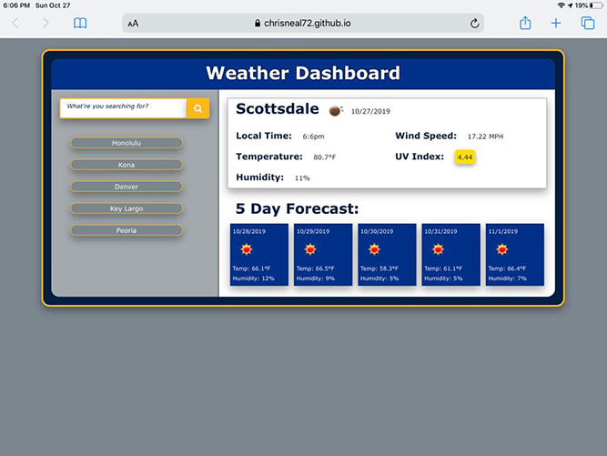

# 06_Wx_Dashboard
​
### Table of Contents
- [Description](#Description)
- [Technologies-Libraries](#Technologies-Libraries)
- [Screenshots](#Screenshots)
- [Link](#Link)
​
### Description
This weather app is our sixth asignment. The layout is bassed on what was given from the homework. The colors are the St Louis Blues web colors and I added a littl depth witht he shadows and rounded the framnig to make the look a little less industrial.

This project uses the OpenWeatherMap API to retrieve the WX information. The landing page uses Geo Location to get the local Wx. The UV index is a separate Ajax call using the Lat and Lon that is returned from the city search. The 5 day forecast is also a seperate Ajax call. The forecast call I use the city name returned from the main call as the main call may be retrieved from a search of city name or by using Lat and Lon. so it is easier to send just the city name from either situation.

This API searches by City Name, if a State is added it does not know what to do. Also if gibberish text is input, the system returns an error. If gibberish is entered the server returns an error. I process the search save only if a useful result is retuned. The latest search is at the top and a saved city will not duplicate, it will just be moved to the top. For example, if I have 5 saved searches, if I click on that save it will move to the top of the list. If I text search a name in the list, it will also move to the top.

​
### Technologies-Libraries
- [Bootstrap](https://getbootstrap.com/) - CSS Framework
- [Font Awesome](https://fontawesome.com/) - CSS Framework
- [Open Weather](https://openweathermap.org/current/) - Weather API
​
### Screenshots
​
Main Screen as seen from my Phone

​
Main Screen as seen from my iPad

​
Main page in a browser

​
### Link
Check it out! 
https://chrisneal72.github.io/06_Wx_Dashboard/